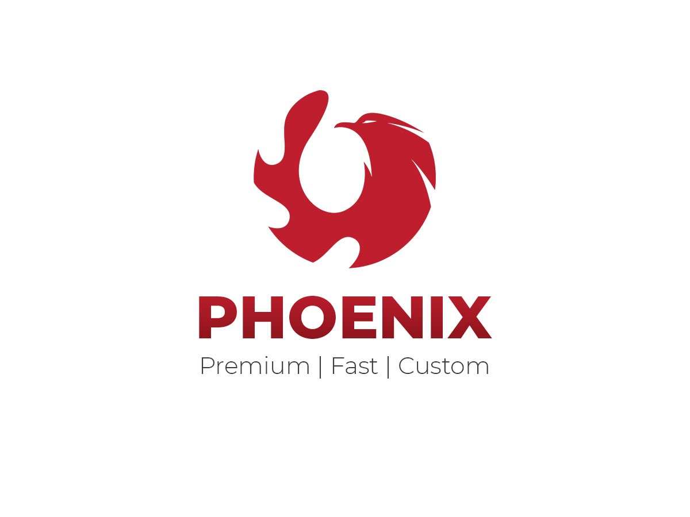

# A Light Weight Fast Theme for Niche Websites

A custom light weight WP theme for niche websites. All the unnecessary loadings and functions were removed from the WordPress system. UI & UX Design psychology principles used to improve the quality. 

## Executed Actions on Theme to Improve the Speed

-	Removed the WPemoji through function.php
-	Font Loading through System Font Stack
-	W3.CSS based responsive functionality 

## Requirements to Develop or Modify the Theme

You need to install AMPPS, WAMP, or XAMP to make your server environment compatible with WordPress installation. 

## Development Path

- Started on: September 22, 2021